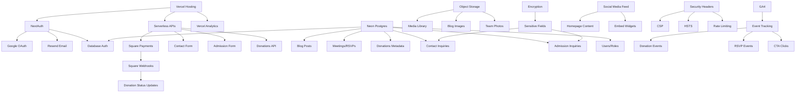

---

name: AVFY Integration & Security Implementation Plan

overview: Complete implementation plan for AVFY integrations and security stack based on the specification, including dependency graph, missing items, security/compliance checklist, and launch-readiness checklist.

todos:

  - id: security-headers

content: "Implement missing security headers: HSTS and CSP (two-stage: Report-Only first) in vercel.json and next.config.js"

status: pending

  - id: ga4-hipaa

content: "Configure GA4 for HIPAA-adjacent safeguards: add IP anonymization, disable user-ID tracking, audit event parameters for PHI"

status: pending

  - id: phi-minimizing-forms

content: Implement PHI-minimizing form design (Strategy A): Add guidance discouraging PHI, store minimal info only

status: pending

  - id: field-encryption

content: Field-level encryption (Strategy B) - Only if explicitly approved

status: pending

  - id: object-storage

content: Migrate media library from base64 database storage to object storage (Vercel Blob recommended) - PRIORITY 1

status: pending

  - id: blog-integrity

content: Verify blog migration integrity: preserve slugs/links + redirects - PRIORITY 3

status: pending

  - id: square-testing

content: Square donation flow end-to-end test + webhook verification - PRIORITY 4

status: pending

  - id: email-testing

content: Test all email notification flows - PRIORITY 5

status: pending

  - id: email-security

content: "Configure email security: SPF, DKIM, and DMARC DNS records for Resend"

status: pending

  - id: audit-logging

content: Implement audit logging for admin actions using existing AuditLog schema

status: pending

  - id: staging-db

content: Create separate Neon database for staging environment and update Vercel preview deployments

status: cancelled

  - id: social-feed

content: Implement social media feed on homepage using embed widgets (lowest risk approach)

status: pending

---

# AVFY Integration & Security Implementation Plan

## Executive Summary

This plan addresses the integration and security requirements for the AVFY website based on the provided specification. The codebase already has significant infrastructure in place, but several critical security and integration gaps need to be addressed before production launch.

**Important Constraints:**

- Use "HIPAA-adjacent safeguards" and "PHI-minimizing design" terminology (NOT "HIPAA compliant")
- CSP implementation in two stages: Report-Only mode first, then enforce after testing
- Separate staging database is NOT a pre-launch blocker (deferred)
- Sensitive field encryption: Strategy A (modify forms to discourage PHI, store minimal) by default; Strategy B (field-level encryption) only if explicitly approved

## Current State Assessment

### ✅ Fully Implemented

- **NextAuth** with Google OAuth, Email magic links, and Credentials provider
- **Resend** transactional email (contact, admission, donations, reminders)
- **Square Payments** with webhook verification and recurring donations
- **Neon Postgres** database with comprehensive schema
- **Rate Limiting** (in-memory, per-IP and per-email)
- **Basic Security Headers** (X-Content-Type-Options, X-Frame-Options, X-XSS-Protection, Referrer-Policy)
- **GA4** basic implementation (needs HIPAA-safe configuration)
- **Vercel Analytics** integrated
- **Encryption utility** (exists but not used for sensitive fields)

### ⚠️ Partially Implemented

- **Media Library**: Stores base64 in database instead of object storage
- **Social Media**: Manual stats entry, no auto-updating feed on homepage
- **Security Headers**: Missing HSTS and CSP
- **GA4**: No anonymization, no consent banner, may send PHI (needs HIPAA-adjacent safeguards)

### ❌ Missing

- **Object Storage** (Vercel Blob, Cloudflare R2, or Supabase Storage)
- **CSP (Content Security Policy)** headers
- **HSTS** header
- **HIPAA-adjacent GA4** configuration
- **PHI-minimizing form design** (Strategy A: discourage PHI, store minimal; Strategy B: encryption if approved)
- **Audit logging** for admin actions (schema exists, not implemented)
- **Email security** (SPF/DKIM/DMARC records)
- **Separate staging database** (DEFERRED - not a pre-launch blocker)
- **Social media feed** on homepage (auto-updating)

## Implementation Plan

### Phase 1: Critical Security Hardening (Must Complete Before Launch)

#### 1.1 Security Headers Completion

**Files to modify:**

- `vercel.json` - Add HSTS header
- `next.config.js` - Add CSP configuration (two-stage approach)
- `src/middleware.ts` - Ensure headers are applied

**Tasks:**

1. Add HSTS header with max-age=31536000; includeSubDomains; preload
2. **CSP Implementation (Two-Stage Approach):**

   - **Stage 1:** Deploy CSP in Report-Only mode (`Content-Security-Policy-Report-Only`)
     - Log violations to console/monitoring
     - Allow all required sources:
       - Self-hosted assets (`'self'`)
       - Google Analytics (`www.googletagmanager.com`, `www.google-analytics.com`)
       - Square checkout (`connect.squareup.com`, `connect.squareupsandbox.com`)
       - Resend email service
       - Social media embeds (if implemented)
   - **Stage 2:** After confirming Square/GA/embeds work, switch to enforced CSP
     - Change to `Content-Security-Policy` (remove `-Report-Only`)
     - Monitor for any violations

3. Test CSP doesn't break existing functionality in Report-Only mode first

#### 1.2 HIPAA-Adjacent GA4 Configuration

**Files to modify:**

- `src/components/analytics/GoogleAnalytics.tsx`
- All files using `trackEvent()` - Audit for PHI in parameters

**Tasks:**

1. Add `anonymize_ip: true` to GA4 config
2. Add `allow_google_signals: false` to disable cross-device tracking
3. Add `allow_ad_personalization_signals: false`
4. Ensure no user-ID tracking (verify no `user_id` parameter)
5. Audit all `trackEvent()` calls to ensure no PHI in event parameters:

   - Check `src/app/donate/page.tsx` (donation tracking)
   - Check `src/components/analytics/GoogleAnalytics.tsx` (all track functions)
   - Verify no names, emails, phone numbers, or application answers sent

6. Consent banner: Use existing privacy policy acknowledgment or add simple banner

#### 1.3 PHI-Minimizing Form Design (Strategy A - Default)

**Files to modify:**

- `src/app/admission/page.tsx` - Add form guidance discouraging PHI
- `src/app/contact/page.tsx` - Add form guidance discouraging PHI
- `src/app/api/admission/route.ts` - Store only minimal necessary info
- `src/app/api/contact/route.ts` - Store only minimal necessary info

**Tasks (Strategy A - Default):**

1. Add form guidance text:

   - "Please do not include medical details, diagnosis information, or other protected health information (PHI) in your message"
   - "We will contact you to discuss details privately"

2. Modify form validation to discourage lengthy messages with potential PHI
3. Store only minimal necessary information (name, email, phone, program interest)
4. Admin dashboard: Display message field but with reminder about PHI handling

**Strategy B (Field-Level Encryption) - Only if explicitly approved:**

- `src/lib/encryption.ts` - Already exists, needs integration
- `src/app/api/admission/route.ts` - Encrypt message field
- `src/app/api/contact/route.ts` - Encrypt message field
- Admin dashboard components - Decrypt when viewing

**Note:** Strategy B will only be implemented if explicitly requested. Default is Strategy A.

#### 1.4 Email Security (SPF/DKIM/DMARC)

**External task (DNS configuration):**

1. Add SPF record: `v=spf1 include:_spf.resend.com ~all`
2. Configure DKIM via Resend dashboard
3. Add DMARC record: `v=DMARC1; p=quarantine; rua=mailto:admin@avisionforyou.org`

### Phase 2: Object Storage Implementation

#### 2.1 Choose and Configure Object Storage

**Decision needed:** Vercel Blob vs Cloudflare R2 vs Supabase Storage

**Recommendation:** Vercel Blob (simplest, native integration)

**Files to modify:**

- `src/app/api/admin/media/route.ts` - Replace base64 storage with object storage
- `package.json` - Add `@vercel/blob` dependency
- Environment variables: `BLOB_READ_WRITE_TOKEN`

**Tasks:**

1. Install and configure Vercel Blob
2. Update media upload endpoint to use `put()` instead of base64
3. Update media retrieval to use signed URLs
4. Migrate existing base64 media to object storage (one-time script)
5. Update `MediaItem` model usage to store URLs instead of data URLs

### Phase 3: Social Media Feed Integration

#### 3.1 Homepage Social Feed

**Files to modify:**

- `src/app/page.tsx` - Add social feed section
- `src/components/shared/SocialFeed.tsx` - New component

**Options:**

1. **Embed widgets** (lowest risk, recommended)

   - Facebook Page Plugin
   - Instagram Basic Display API (requires OAuth)
   - Twitter/X embed

2. **API-based feeds** (more complex, requires tokens)

   - Facebook Graph API
   - Instagram Graph API
   - Twitter API v2

**Recommendation:** Start with embed widgets, upgrade to API later if needed

**Tasks:**

1. Create `SocialFeed` component with embed widgets
2. Add to homepage below hero section
3. Implement lazy-loading for privacy
4. Add "click-to-load" option for enhanced privacy
5. Ensure no tracking cookies violate privacy expectations

### Phase 4: Audit Logging

#### 4.1 Admin Action Audit Trail

**Files to modify:**

- `src/lib/audit.ts` - New utility file
- All admin API routes - Add audit logging

**Tasks:**

1. Create `logAdminAction()` utility function
2. Log all admin actions (create, update, delete) to `AuditLog` table
3. Include: action type, entity, entityId, userId, timestamp, IP address
4. Exclude sensitive data from audit logs
5. Add audit log viewer to admin dashboard

### Phase 5: Environment & Infrastructure

#### 5.1 Separate Staging Database

**Status:** DEFERRED - Not a pre-launch blocker

**Tasks (when requested):**

1. Create separate Neon database for staging
2. Update Vercel preview deployments to use staging DB
3. Update production to use production DB
4. Document database connection strings

#### 5.2 DNS Configuration

**Tasks:**

1. Create `preview.avisionforyou.org` subdomain pointing to Vercel
2. Document all DNS records
3. Plan production domain cutover
4. Add TXT records for domain verification (Google, email auth)
5. Optional: Enable DNSSEC if supported

## Dependency Graph



## Missing or Incomplete Items

### Critical (Block Launch)

1. **CSP Headers** - Content Security Policy not implemented (two-stage approach)
2. **HSTS Header** - Strict-Transport-Security missing
3. **HIPAA-Adjacent GA4** - No IP anonymization, may send PHI in events
4. **Object Storage** - Media stored as base64 in database (not scalable)
5. **Blog Migration Integrity** - Ensure slugs/links preserved with redirects
6. **Square Donation Flow** - End-to-end test + webhook verification
7. **Email Notifications** - Test all email flows

### High Priority (Should Complete Soon)

8. **Email Security** - SPF/DKIM/DMARC records not configured
9. **Audit Logging** - Admin actions not logged (schema exists, not used)
10. **Social Media Feed** - No auto-updating feed on homepage
11. **PHI-Minimizing Forms** - Strategy A: Add guidance discouraging PHI (default)

### Medium Priority (Nice to Have)

12. **Video Embedding** - No privacy-enhanced embed mode
13. **Board Portal** - Not implemented (if needed)
14. **DNSSEC** - Optional security enhancement
15. **Virus Scanning** - For public uploads (optional)
16. **Separate Staging DB** - Deferred (not a pre-launch blocker)

## Security & Compliance Checklist

### Authentication & Access Control

- [x] NextAuth configured with Google OAuth
- [x] Role-based authorization (ADMIN/STAFF/USER)
- [x] Session security (JWT strategy)
- [x] CSRF protection (NextAuth handles)
- [ ] Invite-only admin access (optional but recommended)
- [ ] IP allowlist for admin endpoints (optional)

### Database Security

- [x] TLS connections only (Neon default)
- [x] Strong DB credentials
- [ ] Credential rotation policy documented
- [x] Least privilege DB user
- [x] Encryption at rest (Neon provides)
- [x] Backups enabled (Neon default)
- [ ] Separate staging vs production DB

### Payment Security

- [x] Square-hosted checkout (no card data handling)
- [x] Webhook signature verification
- [x] Store only transaction IDs + metadata
- [x] Least-privilege API keys
- [x] Separate sandbox vs prod keys
- [x] No PHI in payment metadata

### Email Security

- [x] Resend transactional email configured
- [ ] SPF record configured
- [ ] DKIM configured via Resend
- [ ] DMARC record configured
- [x] Avoid sending sensitive form contents via email
- [x] Send dashboard links instead of data

### Analytics (HIPAA-Adjacent Safeguards)

- [x] GA4 integrated
- [ ] IP anonymization enabled
- [ ] User-ID tracking disabled
- [ ] No PHI in event parameters (audit needed)
- [ ] Consent banner implemented (or privacy policy acknowledgment)
- [x] Vercel Analytics (safe, no PHI)

### Security Headers

- [x] X-Content-Type-Options: nosniff
- [x] X-Frame-Options: SAMEORIGIN
- [x] X-XSS-Protection: 1; mode=block
- [x] Referrer-Policy: strict-origin-when-cross-origin
- [ ] HSTS: Strict-Transport-Security (MISSING)
- [ ] CSP: Content-Security-Policy (MISSING)

### Rate Limiting & Abuse Prevention

- [x] Contact form rate limiting (5/day per IP)
- [x] Admission form throttling (10/day per IP, 1/day per email)
- [x] Donation endpoint protection (5/hour per IP)
- [ ] Basic bot protection (optional, consider Cloudflare)

### Data Minimization (HIPAA-Adjacent Safeguards)

- [x] Application form collects minimal info
- [ ] Form guidance discouraging PHI (Strategy A - default)
- [ ] Field-level encryption (Strategy B - only if approved)
- [x] Admin access restricted
- [x] No sensitive content to GA4
- [x] No sensitive content to email bodies
- [x] Dashboard links instead of data in emails

### Logging Policy

- [x] No form contents in server logs
- [x] Log only request IDs and status
- [ ] Audit logging for admin actions (schema exists, not implemented)

### Backups & Recovery

- [x] DB backups (Neon automatic)
- [ ] Storage backups (if using object storage)
- [ ] Recovery procedure documented

## Launch-Readiness Checklist

### Infrastructure

- [ ] Vercel production deployment configured
- [ ] Production domain DNS configured
- [ ] Preview subdomain (preview.avisionforyou.org) configured
- [ ] Environment variables set in Vercel
- [ ] Separate staging database created (DEFERRED)
- [ ] Database migrations applied to production

### Integrations

- [ ] NextAuth NEXTAUTH_SECRET set
- [ ] NextAuth NEXTAUTH_URL set to production domain
- [ ] Google OAuth redirect URIs configured for production
- [ ] Resend API key configured
- [ ] Square production API keys configured
- [ ] Square webhook endpoint configured in Square dashboard
- [ ] GA4 property ID configured
- [ ] Object storage configured (Vercel Blob/R2/Supabase)

### Security

- [ ] All security headers implemented (including HSTS and CSP - two-stage)
- [ ] HIPAA-adjacent GA4 configuration applied
- [ ] PHI-minimizing form design implemented (Strategy A)
- [ ] Email security (SPF/DKIM/DMARC) configured
- [ ] Rate limiting tested
- [ ] Webhook signature verification tested
- [ ] Admin authentication tested

### Content & Features

- [ ] Homepage social feed implemented (or deferred)
- [ ] Media library migrated to object storage
- [ ] Blog migration integrity verified (slugs/links preserved, redirects working)
- [ ] All forms tested end-to-end
- [ ] Email notifications tested (all flows)
- [ ] Square donation flow tested end-to-end (sandbox and production)
- [ ] Square webhook verification tested
- [ ] RSVP system tested
- [ ] Admin dashboard functional

### Testing

- [ ] All API endpoints tested
- [ ] Error handling tested
- [ ] Rate limiting tested
- [ ] Security headers verified (use securityheaders.com)
- [ ] GA4 events verified (no PHI)
- [ ] Webhook processing tested
- [ ] Email delivery tested
- [ ] Mobile responsiveness tested

### Documentation

- [ ] Environment variables documented
- [ ] Deployment process documented
- [ ] DNS records documented
- [ ] Admin access procedures documented
- [ ] Backup/recovery procedures documented
- [ ] Security incident response plan

### Legal & Compliance

- [ ] Privacy policy updated
- [ ] Terms of service updated
- [ ] Cookie consent banner (if required)
- [ ] HIPAA-adjacent safeguards review completed
- [ ] Data retention policy documented

## Implementation Priority

### Must Complete Before Launch

1. **Object Storage Migration** - Replace base64 DB media storage
2. **GA4 HIPAA-Adjacent Settings** - Anonymize IP, disable ad personalization, no user-id, audit trackEvent params
3. **Blog Migration Integrity** - Preserve slugs/links + redirects
4. **Square Donation Flow** - End-to-end test + webhook verification
5. **Email Notification Tests** - Test all email flows
6. **CSP Headers** - Two-stage (Report-Only first, then enforce)
7. **HSTS Header** - Strict-Transport-Security
8. **PHI-Minimizing Forms** - Strategy A (form guidance discouraging PHI)

### Should Complete Within 1 Week of Launch

9. Email Security (SPF/DKIM/DMARC)
10. Audit Logging Implementation

### Can Defer Post-Launch

11. Social Media Feed on Homepage
12. Board Portal (if needed)
13. Video Embedding Enhancements
14. DNSSEC
15. Virus Scanning
16. Separate Staging Database (DEFERRED - not a pre-launch blocker)
17. Field-Level Encryption (Strategy B - only if explicitly approved)

## Detailed Implementation Checklist with File Paths

### Priority 1: Object Storage Migration

**Files to modify:**

- `package.json` - Add `@vercel/blob` dependency
- `src/app/api/admin/media/route.ts` - Replace base64 storage with Vercel Blob
- `src/app/admin/media/page.tsx` - Update to use blob URLs instead of data URLs
- `src/lib/storage.ts` - NEW: Create storage utility for blob operations
- Environment: Add `BLOB_READ_WRITE_TOKEN` to Vercel

**Tasks:**

1. Install `@vercel/blob` package
2. Create `src/lib/storage.ts` with `uploadFile()` and `getSignedUrl()` functions
3. Update `POST /api/admin/media` to use `put()` instead of base64
4. Update media retrieval to generate signed URLs
5. Create migration script: `scripts/migrate-media-to-blob.ts` (one-time)
6. Update `MediaItem` usage throughout codebase to use blob URLs
7. Test upload, retrieval, and deletion

### Priority 2: GA4 HIPAA-Adjacent Configuration

**Files to modify:**

- `src/components/analytics/GoogleAnalytics.tsx` - Add anonymization settings
- `src/app/donate/page.tsx` - Audit donation tracking for PHI
- `src/components/analytics/GoogleAnalytics.tsx` - Audit all trackEvent functions

**Tasks:**

1. Update GA4 config in `GoogleAnalytics.tsx`:

   - Add `anonymize_ip: true`
   - Add `allow_google_signals: false`
   - Add `allow_ad_personalization_signals: false`
   - Verify no `user_id` parameter

2. Audit `trackDonation()` - ensure no PHI (amount only, no names/emails)
3. Audit `trackSignup()` - ensure no PHI
4. Audit `trackAssessmentComplete()` - ensure no PHI
5. Audit `trackRSVP()` - ensure no PHI
6. Audit `trackProgramView()` - ensure no PHI
7. Check `src/app/donate/page.tsx` line 90-91 for any PHI in gtag calls
8. Add consent banner component (or use privacy policy acknowledgment)

### Priority 3: Blog Migration Integrity

**Files to check/modify:**

- `src/app/blog/page.tsx` - Verify blog listing
- `src/app/blog/[id]/page.tsx` - Verify blog detail page
- `prisma/schema.prisma` - Verify BlogPost model has slug field
- `src/app/api/blog/route.ts` - Verify slug handling
- `next.config.js` - Add redirects if needed

**Tasks:**

1. Verify all blog posts have unique slugs
2. Test blog post URLs: `/blog/[slug]`
3. If migrating from old system, create redirects in `next.config.js`:
   ```js
   redirects: async () => [
     { source: '/old-blog/:slug', destination: '/blog/:slug', permanent: true }
   ]
   ```

4. Test all existing blog links work
5. Verify RSS feed if exists

### Priority 4: Square Donation Flow Testing

**Files to test:**

- `src/app/donate/page.tsx` - Donation form
- `src/app/api/donate/square/route.ts` - Donation API
- `src/app/api/webhooks/square/route.ts` - Webhook handler
- `src/app/donation/confirm/page.tsx` - Confirmation page
- `src/app/donate/success/page.tsx` - Success page

**Tasks:**

1. Test donation form submission
2. Test Square checkout link generation
3. Test Square sandbox payment completion
4. Test webhook signature verification
5. Test donation status update in database
6. Test email confirmation sent
7. Test recurring donation setup
8. Test webhook event handling (payment.completed, subscription.created)
9. Verify webhook logs in database
10. Test production Square keys (after sandbox verification)

### Priority 5: Email Notification Tests

**Files to test:**

- `src/lib/email.ts` - All email functions
- `src/app/api/contact/route.ts` - Contact form emails
- `src/app/api/admission/route.ts` - Admission emails
- `src/app/api/donate/square/route.ts` - Donation emails
- `src/app/api/meetings/route.ts` - RSVP reminder emails

**Tasks:**

1. Test contact form notification email
2. Test contact form confirmation email
3. Test admission inquiry notification email
4. Test admission inquiry confirmation email
5. Test donation confirmation email
6. Test meeting reminder emails (24h and 1h)
7. Verify all emails use dashboard links (not sensitive data)
8. Test email delivery in Resend dashboard
9. Verify SPF/DKIM/DMARC setup (external DNS task)

### Priority 6: CSP Headers (Two-Stage)

**Files to modify:**

- `next.config.js` - Add CSP configuration
- `vercel.json` - Add HSTS header (if not in middleware)
- `src/middleware.ts` - Verify headers applied

**Tasks:**

1. **Stage 1 - Report-Only:**

   - Add `Content-Security-Policy-Report-Only` header in `next.config.js`
   - Configure policy allowing:
     - `'self'` (self-hosted assets)
     - `https://www.googletagmanager.com` (GA4)
     - `https://www.google-analytics.com` (GA4)
     - `https://connect.squareup.com` (Square production)
     - `https://connect.squareupsandbox.com` (Square sandbox)
     - `https://resend.com` (if needed)
     - `'unsafe-inline'` for styles (temporary, tighten later)
     - `'unsafe-eval'` for GA4 (if needed)
   - Deploy and monitor violations in browser console
   - Log violations to monitoring service (optional)

2. **Stage 2 - Enforce (after testing):**

   - Change to `Content-Security-Policy` (remove `-Report-Only`)
   - Tighten policy (remove `unsafe-inline` if possible)
   - Monitor for any violations
   - Test all functionality (Square checkout, GA4, embeds)

### Priority 7: HSTS Header

**Files to modify:**

- `vercel.json` - Add HSTS header
- OR `src/middleware.ts` - Add HSTS header

**Tasks:**

1. Add `Strict-Transport-Security: max-age=31536000; includeSubDomains; preload`
2. Test header appears in response
3. Verify HTTPS redirect works

### Priority 8: PHI-Minimizing Forms (Strategy A)

**Files to modify:**

- `src/app/admission/page.tsx` - Add form guidance
- `src/app/contact/page.tsx` - Add form guidance
- `src/app/api/admission/route.ts` - Verify minimal storage
- `src/app/api/contact/route.ts` - Verify minimal storage

**Tasks:**

1. Add guidance text to admission form:

   - "Please do not include medical details, diagnosis information, or other protected health information (PHI) in your message. We will contact you to discuss details privately."

2. Add guidance text to contact form:

   - "Please do not include sensitive personal or medical information. We will contact you to discuss details privately."

3. Verify forms store only minimal necessary info
4. Update admin dashboard to show reminder about PHI handling

## Notes

- Do not invent new integrations beyond the specification
- Assume Vercel, Neon, NextAuth, GA4, Resend, Square, Object Storage only
- All changes must maintain HIPAA-adjacent safeguards and PHI-minimizing design
- Test thoroughly in staging before production deployment
- Document all environment variables and configuration changes
- CSP must be deployed in Report-Only mode first, then enforced after testing
- Separate staging database is DEFERRED (not a pre-launch blocker)
- Field-level encryption (Strategy B) only if explicitly approved